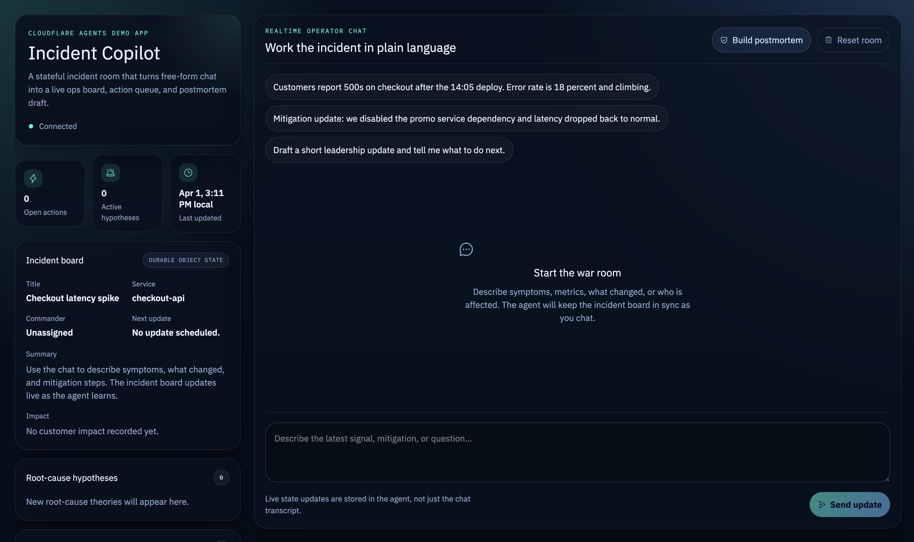

# Incident Copilot

A stateful incident-response copilot built on Cloudflare Agents.

It turns free-form operator chat into a live incident board with persistent state, root-cause hypotheses, action items, and a generated postmortem draft.

## Live demo

[incident-copilot.mohamsal.workers.dev](https://incident-copilot.mohamsal.workers.dev)

## Screenshot



## Assignment mapping

This project covers the requested AI app components:

- `LLM`: Workers AI
- `Workflow / coordination`: structured agent tools update and maintain the incident board
- `User input`: realtime chat interface
- `Memory / state`: Durable Object state plus persisted chat history

## Stack

- Cloudflare Agents SDK
- Workers AI
- Durable Objects
- React + Vite

## How to try it

### Option 1: Use the deployed app

Open the live demo link above and try prompts like:

- `Customers report 500s on checkout after the 14:05 deploy. Error rate is 18 percent and climbing.`
- `We suspect the promo service integration is timing out. Add likely causes and next actions.`
- `Mitigation update: we disabled the promo dependency and latency dropped back to normal.`
- `Draft a short leadership update and tell me what still needs to be verified.`

Expected behavior:

- the incident board updates live
- state persists across refreshes
- multiple tabs stay in sync
- the postmortem draft is generated from the incident history

### Option 2: Run locally

```bash
npm install
npm run dev
```

Then open `http://localhost:5173`.

## Deploy locally to your own Cloudflare account

```bash
npm run deploy
```

## Project files

- [src/server.ts](./src/server.ts): Cloudflare Agent, tool definitions, and Workers AI integration
- [src/app.tsx](./src/app.tsx): React UI and realtime agent client
- [PROMPTS.md](./PROMPTS.md): prompts used while building the project with AI assistance
